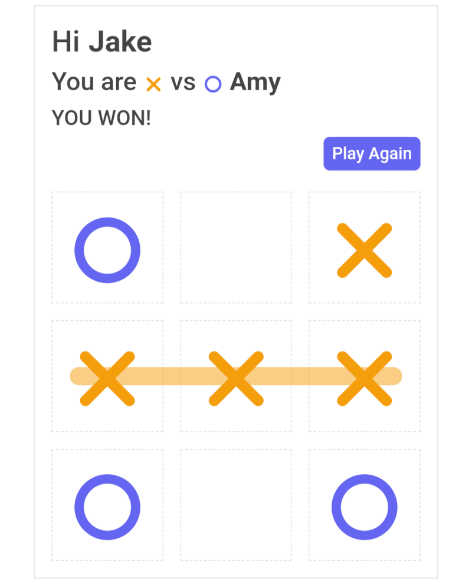

# Tic Tac Toe - Node

This repository includes an implementation of a simple Tic Tac Toe game with multiplayer support
provided by a Node.js websocket server.

## Usage

```bash
> npm run dev        # run both client and server
> npm run dev:client # run client only
> npm run dev:server # run server only
> npm run test       # run (server) unit tests
> npm run lint       # run eslint
> npm run build      # build production assets
```




## Overview

There are 2 main components

  * **client** is the client side entry point that constructs a websocket
    and connects to the server. It has no real game logic and simply sends commands
    to the server in response to user actions and then updates the UX in response to
    events it receives back from the server.
  * **server** is the websocket server that does all the heavy lifting and manages
    a `Lobby` of `Players` and the `Game` that they are currently playing. It responds
    to commands it receives from the websocket clients by updating game state and
    sending events back.

## Enums

The **client** and **server** share some simple enums and interfaces that help define some of the
key concepts in a Tic-Tac-Toe game, and can be found in the `interface` module:

```typescript
export enum Piece {
  Dot   = "dot",
  Cross = "cross",
}

export enum Position {
  TopLeft     = "top-left",
  Top         = "top",
  TopRight    = "top-right",
  Left        = "left",
  Center      = "center",
  Right       = "right",
  BottomLeft  = "bottom-left",
  Bottom      = "bottom",
  BottomRight = "bottom-right",
}

export enum WinningLine {
  TopRow       = "top-row",
  MiddleRow    = "middle-row",
  BottomRow    = "bottom-row",
  LeftColumn   = "left-column",
  CenterColumn = "center-column",
  RightColumn  = "right-column",
  DownDiagonal = "down-diagonal",
  UpDiagonal   = "up-diagonal",
}
```

In addition, the `PlayerState` enum acts as a state machine for the player who can be in any one
of the following states at any given time:

```typescript
export enum PlayerState {
  Joining     = "Joining",
  WaitingGame = "WaitingGame",
  TakingTurn  = "TakingTurn",
  WaitingTurn = "WaitingTurn",
  Won         = "Won",
  Lost        = "Lost",
  Tied        = "Tied",
  Abandoned   = "Abandoned",
}
```

The `Player` interface represents the minimalist representation of a player that is sent
between the client and server. They must have a state and a name, and they *might* have a
piece if they are currently playing a game.

```typescript
export interface Player {
  state: PlayerState;
  name: string;
  piece?: Piece;
}
```

## Commands

The `client` and `server` also share some important types that enable our event driven
architecture where a `Command` can be sent to the server and an `Event` can be sent back
to the client. We use a pattern called a [discriminated union](https://www.typescriptlang.org/docs/handbook/2/narrowing.html#discriminated-unions)
to represent all of the possible commands and their arguments.

```typescript
export enum Command {
  Join   = "Join",
  Turn   = "Turn",
  Leave  = "Leave",
  Replay = "Replay",
}

interface JoinCommand {
  type: Command.Join;
  name: string;
}

interface TurnCommand {
  type: Command.Turn;
  position: Position;
}

interface LeaveCommand {
  type: Command.Leave;
}

interface ReplayCommand {
  type: Command.Replay;
}

export type AnyCommand =
  | JoinCommand
  | TurnCommand
  | LeaveCommand
  | ReplayCommand
```

This pattern enables our **server** to easily switch based on the command and perform different actions:

```typescript
execute(command: AnyCommand) {
  switch(command.type) {
  case Command.Join:   return this.join(command.name)
  case Command.Turn:   return this.turn(command.position)
  case Command.Leave:  return this.leave()
  case Command.Replay: return this.replay()
  }
}
```

## Events

Similarly, we use the same [discriminated union](https://www.typescriptlang.org/docs/handbook/2/narrowing.html#discriminated-unions)
pattern to represent all of the possible events and their arguments.

```typescript
export enum Event {
  PlayerReady       = "PlayerReady",
  GameStarted       = "GameStarted",
  PlayerTookTurn    = "PlayerTookTurn",
  OpponentTookTurn  = "OpponentTookTurn",
  OpponentAbandoned = "OpponentAbandoned",
  PlayerWon         = "PlayerWon",
  PlayerLost        = "PlayerLost",
  PlayerTied        = "PlayerTied",
  UnexpectedError   = "UnexpectedError",
}

export interface PlayerReadyEvent {
  type: Event.PlayerReady;
  player: Player;
}

export interface GameStartedEvent {
  type: Event.GameStarted;
  player: Player;
  opponent: Player;
}

export interface PlayerTookTurnEvent {
  type:     Event.PlayerTookTurn;
  player:   Player;
  opponent: Player;
  position: Position;
}

export interface OpponentTookTurnEvent {
  type:     Event.OpponentTookTurn;
  player:   Player;
  opponent: Player;
  position: Position;
}

export interface OpponentAbandonedEvent {
  type:     Event.OpponentAbandoned;
  player:   Player;
  opponent: Player;
}

export interface PlayerWonEvent {
  type: Event.PlayerWon;
  player: Player;
  opponent: Player;
  line: WinningLine;
}

export interface PlayerLostEvent {
  type: Event.PlayerLost;
  player: Player;
  opponent: Player;
  line: WinningLine;
}

export interface PlayerTiedEvent {
  type: Event.PlayerTied;
  player: Player;
  opponent: Player;
}

export interface UnexpectedErrorEvent {
  type: Event.UnexpectedError;
  error: UnexpectedError;
}

export type AnyEvent =
  | PlayerReadyEvent
  | GameStartedEvent
  | PlayerTookTurnEvent
  | OpponentTookTurnEvent
  | OpponentAbandonedEvent
  | PlayerWonEvent
  | PlayerLostEvent
  | PlayerTiedEvent
  | UnexpectedErrorEvent
```

This pattern enables our **client** to easily switch based on the event in order
to handle it appropriately.

```typescript
handle(event: AnyEvent) {
  switch(event.type) {
  case Event.PlayerReady:       return this.onPlayerReady(event)
  case Event.GameStarted:       return this.onGameStarted(event)
  case Event.PlayerTookTurn:    return this.onPlayerTookTurn(event)
  case Event.OpponentTookTurn:  return this.onOpponentTookTurn(event)
  case Event.OpponentAbandoned: return this.onOpponentAbandoned(event)
  case Event.PlayerWon:         return this.onPlayerWon(event)
  case Event.PlayerLost:        return this.onPlayerLost(event)
  case Event.PlayerTied:        return this.onPlayerTied(event)
  case Event.UnexpectedError:   return this.onError(event.error)
  }
}
```

## The Client

_coming soon_

## The Server

_coming soon_


## Repository Structure

The repository includes:

```console
    └── index.html          - page layout and templates
    └── public              - static assets 
    └── src
        └── interface.ts    - abstract types used by both client and server
        └── server.ts       - THE WEBSOCKET SERVER
        └── client.ts       - THE WEBSOCKET CLIENT
        └── client
            └── header.ts   - a webcomponent
            └── board.ts    - a webcomponent
```
